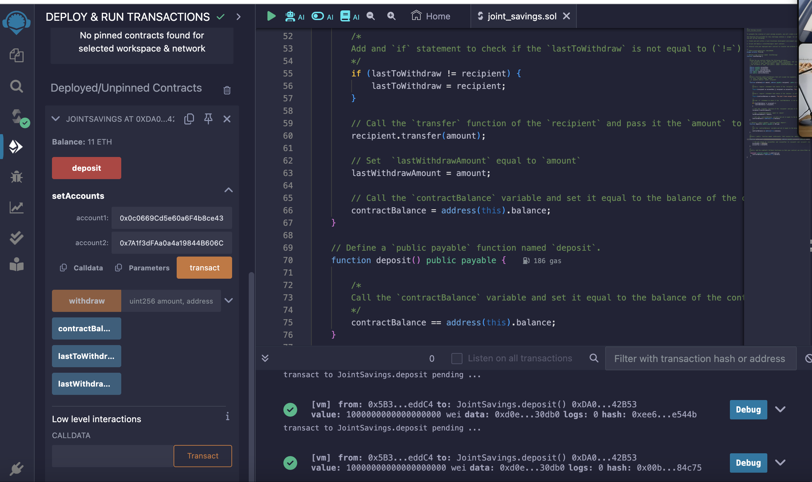

# Joint Savings Account Solidity Smart Contract

## Overview
This Solidity smart contract automates the creation and management of joint savings accounts on an Ethereum-compatible blockchain. It allows two user addresses to control a joint savings account and provides functionalities for depositing and withdrawing funds.

## Functions Summary
- `withdraw(uint amount, address payable recipient)`: Allows account holders to withdraw funds from the joint savings account. The `require` statements ensure that the recipient is one of the authorized account holders (accountOne or accountTwo) and that the contract has sufficient funds to fulfill the withdrawal request. If either condition fails, the transaction is reverted with an error message.
- `deposit()`: Allows users to deposit funds into the joint savings account.
- `setAccounts(address payable account1, address payable account2)`: Sets the two account holders for the joint savings account.
- `receive() external payable`: Fallback function to accept and store Ether sent from outside the deposit function.

## Deployment and Interaction Instructions
1. Open the _joint_savings.sol_ Solidity file in Remix IDE.
2. Compile the contract.
3. Deploy the contract on Remix using the JavaScript VM environment.
4. Interact with the deployed contract by:
   - Setting the accounts using the `setAccounts` function.
   - Depositing funds using the `deposit` function.
   - Withdrawing funds using the `withdraw` function.

## Screenshots of Executed Transactions
### Set Accounts

____
### Deposit 1 ether

____
### Deposit 10 ether

____
### Deposit 5 ether

____
### Withdraw 5 ether into Account 1

____
### Withdraw 10 ether into Account 2

____

